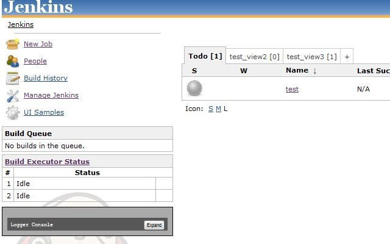

:toc:
:toc-placement!:

This plugin shows a Views TabBar like the original one but it adds how
many jobs has each view in every tab title.

toc::[]

Screenshots
-----------

Usage
-----

Go to *Manage Jenkins* -> *Configure System*. Then, in the *Views Tab
Bar* item, select *CountJobs Views TabBar*.

Notes
-----

The https://plugins.jenkins.io/dropdown-viewstabbar-plugin[DropDown
ViewsTabBar Plugin] already implements an option to show the number of
jobs in each view. This one, though, sticks to the Jenkins' classic look
and feel.

Changelog
---------

Version 1.0.1
~~~~~~~~~~~~~

* More recent jenkins-core version
* Doc migrated to github
* Build on ci.jenkins.io

Version 1.0.0
~~~~~~~~~~~~~

* Initial Release

 
